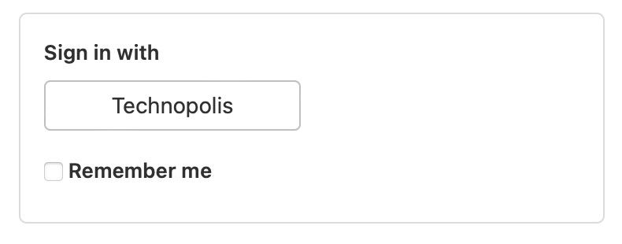

# Инструкция для входа в bmstu.codes

- Для того, чтоб зайти в gitlab необходимо выбрать способ Sign in with Technopolis (скриншот). Дальше вводите данные от учётной записи именно технополиса, а не общую бауманскую. 

- Учётная запись технополиса должна быть у большинства ребят, которые учились на бакалавриате в МГТУ. Если у кого-то его нет или кто-то учился в другом вузе вам надо будет зарегистрироваться.

- Ещё момент - при сбросе пароля от технополиса система может сказать, что такого eMail’а в системе нет - тогда пробуйте по личной почте, скорее всего аккаунт технополиса прикреплен на него.

- Если возникли какие-то другие технические вопросы/проблемы, обращайтесь сюда:
support@bmstu.cloud